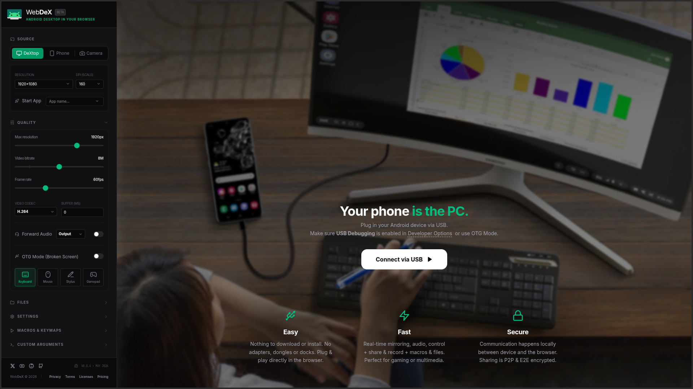

# WebDeX: Android Desktop (and more) in your Browser 🚀

**WebDeX** is a professional grade, install-free, high-performance, web-based Android "Desktop Mode" (DeX) client that allows you to control, interact and share your Android device directly from any Chrome based web browser. It delivers a seamless Android Desktop experience without the need for native software installation. Features screen mirroring, virtual display, camera support, audio, file manager, macros, stream sharing/recording, OTG Mode and more.

## ✨ Features

- **Easy**: Nothing to download or install. No adapters, dongles, or docks required. Plug & play directly in your browser.
- **Fast**: Real-time mirroring, audio, control, plus stream sharing, recording, macros, and file transfers. Optimized for gaming and multimedia.
- **Secure**: Communication happens locally between your device and the browser. Sharing sessions are P2P and E2E encrypted.

## 🛠️ Getting Started

### Prerequisites
- A modern browser with **WebUSB support** (Chrome, Edge, Opera, Vivaldi, Brave).
- An Android device with **USB Debugging** enabled (Developer Options).

### How to use
1. **Connect Device**: Navigate to https://WebDeX.top, plug your Android device into your computer via USB and click "Connect".
2. **USB Permission**: When prompted by the browser, select your device from the list.
3. **ADB Authorization**: Confirm the "Allow USB Debugging" prompt on your device screen.

## 📱 Use Cases & Advanced Scenarios

WebDeX goes beyond on-the-go personal Android Desktop and screen/camera mirroring, enabling powerful workflows:

- **Broken Screen Recovery**: Easily access and rescue data from devices with unresponsive or broken touchscreens by controlling them via mouse and keyboard (or macros).
- **Gaming & Productivity**: Work or play mobile games on a larger screen with nearly-zero latency. Use macros to automate tasks of for game keymaps.
- **OTG Control**: Control your device via an OTG USB-to-USB connection from another phone or PC.
- **Debugging**: Enable Developer Options, configure Wireless ADB, or manage apps without needing a terminal on your host machine.
- **Second life for damaged devices**: Disable touchscreen or prevent "phantom touch" issues. 
- **Offline mode**: WebDex is local-first. It works even in airplane mode.

## 📜 Credits & Acknowledgments

WebDeX is built upon the incredible work of the open-source community. Special thanks to:

- **[Scrcpy](https://github.com/Genymobile/scrcpy)**: The powerhouse for Android screen mirroring and control.
- **[WebADB](https://github.com/yume-chan/ya-webadb)**: The exceptional implementation enabling browser-to-ADB communication.

## 🤝 Community & Support

Stay updated and get help through our official channels:

- **X**: [@WebDeX_top](https://x.com/WebDeX_top)
- **YouTube**: [@WebDeX_top](https://www.youtube.com/@WebDeX_top)
- **GitHub**: [WebDeX-top](https://github.com/WebDeX-top)

## 🐛 Issues

Report bugs or request features at our [GitHub Issues](https://github.com/WebDeX-top/webdex/issues) page.
